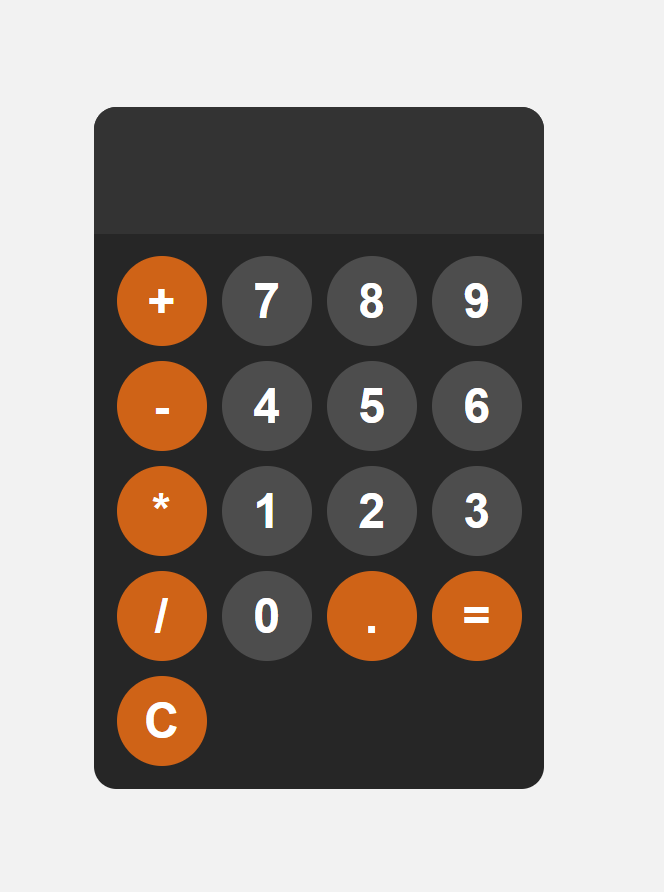

# Simple JavaScript Calculator

## Description
This project is a responsive, user-friendly JavaScript calculator that performs basic arithmetic operations such as addition, subtraction, multiplication, and division. Designed with a sleek UI, it's perfect for learning fundamental JavaScript, HTML, and CSS concepts.

## Features
Performs basic operations: +, -, *, /.
Clear (C) and decimal point (.) support.
Responsive design for better usability across devices.
User-friendly interface with smooth button interactions.

## How to Run
1. Download the project files: [Download Here](https://github.com/makooster/front-projects/calculator/calculator.zip)
2. Open `main.html` in your browser.

## Screenshots
Here is how calculator looks

## Tech Stack
HTML5: For structure.
CSS3: For styling and responsive design.
JavaScript (ES6): For functionality.

## Future Improvements
Add support for advanced operations (e.g., square root, exponentiation).
Enhance error handling for invalid inputs.
Add keyboard support for easier interaction.

## Author
Akhmadi Magzhan, my GitHub account : www.github.com/makooster/
Feel free to reach out with feedback or suggestions!